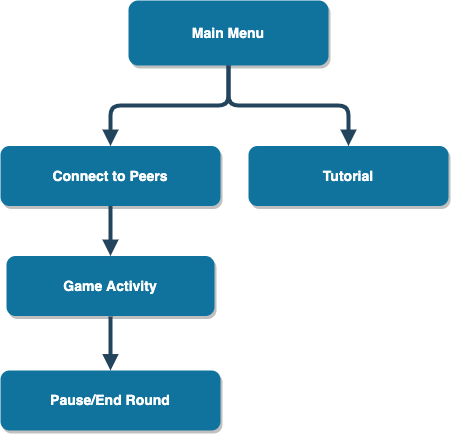
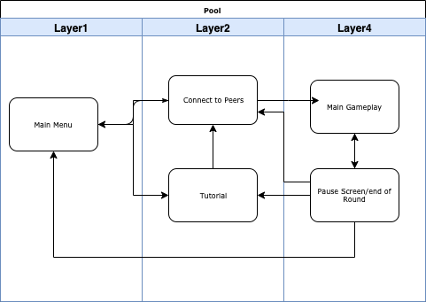
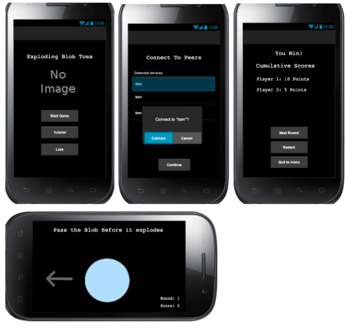

# Exploding Blob Toss

# Table of contents

<!-- TOC -->

- [Abstract](#abstract)
	- [Group members](#group-members)
	- [Description](#description)
		- [Introduction](#introduction)
		- [Users](#users)
		- [Mode, Medium, Environment](#mode-medium-environment)
	- [Features](#features)
	- [Libraries](#libraries)
	- [Requirements](#requirements)
	- [Installation Notes](#installation-notes)
	- [Final Project Status](#final-project-status)
	    - [Minimum Functionality](#minimum-functionality)
    	- [Expected Functionality](#expected-functionality)
    	- [Bonus Functionality](#bonus-functionality)
    - [Code Examples](#code-examples)
    - [Functional Decomposition](#functional-decomposition)
    - [High-level Organization](#high-level-organization)
	- [Clickstreams](#clickstreams)
	- [Layout](#layout)
	- [Implementation](#implementation)
	- [Future Work](#future-work)
	- [Sources](#sources)

<!-- /TOC -->

## Abstract
Exploding Blob Toss is a mobile game designed to bring people together. It features multiplayer, physical gameplay and a fun and engaging interface. Players will “toss” an animated blob from one phone to another and try not to have the blob when it explodes. It is an ideal game for social settings where users want to engage with each other in a competitive way. It is intended to be a game that uses technology to enhance social experiences rather than taking away from them.

## Group members

| Name                   | Banner ID  | Email               |
| ---------------------- | ---------- | ------------------- |
| Samantha Butler        | B00647590  | s.butler@dal.ca     |
| Maria Jessen           | B00743170  | mjessen@dal.ca     |

## Description

### Introduction

Exploding Blob Toss is a two-player Android game that pairs social interaction with electronic gameplay. Upon forming a local network between their devices, users compete to pass a “blob” between their phones using physical gestures. They “toss” the blob by flicking their devices in a direction specified by the game. This process continues until the blob explodes, deeming the holder of the exploded blob the loser of the round.

The app bears some resemblance to real-world games like hot-potato and the game mechanics resemble those of active games for consoles such as the Nintendo Wii, which uses motion sensing technology to allow players to control the game using their bodies. The unique use of connectivity and gesture gameplay makes the game ideal for settings where users want a group activity but have no recreational equipment but their phones. Users will have an exciting and fast-paced portable game at their disposal at any time.

### Users

This game is intended to be suitable for adults and older children. The active nature of the game may pose risks to younger, less-coordinated players. Because most app stores require users to be at least thirteen years of age, this is not likely to limit our audience.

### Mode, Medium, Environment

Exploding Blob Toss is suitable for use in locations where there is no network access. It is a fun game at a summer camp, around a campfire, at a party, or for an icebreaker. Users play the game facing each other. The app requires users to be within direct sight of each other for them to play effectively. It requires users to anticipate the next throw from the user next to them.

The app is meant to be a fully immersive experience so it is played with full focus on the game. The sound effects add charm that cannot be enjoyed when played in a restrictive environment, such as a loud party or noise-sensitive area such as a lecture. It could be played with no sound, but the experience would just not be the same.

This is a local multiplayer game. Players connect through WiFi Direct. This requires that users be close to each other, but the gameplay mechanics require that they be far enought apart that their phones are not likely to collide. Devices connected over Wifi Direct can be a safe distance apart without hindering communication over the network. This maintains the social focus of the application without restricting movement or causing damage.

The app uses the accelerometer to detect device shakes and determine whether the user is tossing the blob in the right direction. We assume that the users will follow the app’s directions and align themselves propery for this action to make sense. 

Users receive haptic feedback when they press buttons, when the blob is passed to them and when they throw it. This provides a clearer indication that they have performed an action and attempts to replace the physical sensations of throwing and catching that are otherwise lost in the virtual format. Users can feel the catch and throw of the blob in addition to seeing it. 

## Features
* I can connect with another player
* I can throw and catch the blob with my opponent using a physical gesture
* The blob will randomly explode leaving whoever was holding it last the loser
* I can drop the blob if I do not react to my opponent's throw fast enough, thereby losing the game

## Libraries

* **Flaticon**: A database of icons. Source [here](https://www.flaticon.com/)
* **FreeSound**: A database of sound effects. Source [here](https://freesound.org/)

## Hardware Requirements
#### Minimum
* Wifi Direct compatible and enabled
* Accelerometer enabled

#### Best Experience
* Haptic feedback enabled

## Installation Notes

None. The app can be installed normally using the provided APK. **(LINK)**

## Final Project Status

### Minimum
1. Two users can connect to game via Wifi Direct
2. Users can pass a plain 2D object to each other using accelerometer motions
3. Usernames set automatically by system CHANGE: using the network IDs of the device
4. A random number, x, of turns is set at the beginning of the game. Immediately after the x thturn, the blob pops and the user who received the blob on that turn loses the round.

### Expected
1. When a phone receives the blob, it vibrates
2. Sound effects
3. Simple sliding animations for the blob

### Bonus - none completed.
1. Richer animations for blob movement
2. Different games modes


## Code Examples

### WiFi Direct and socket programming issues
We encountered considerable difficulties with WiFi Direct throughout the development process. As it was meant to be an early part of the development process, when it presented roadblocks, it halted other phases of development and left us far behind schedule. 

For clarification, when a WiFi Direct network is established, it has an Owner (also called the server) and at least one client. The server device controls the network and all clients connect to the server. 
  
It was very difficult to establish a connection between the two devices as we were not familiar with the the technology. Even after following several tutorials and reading troubleshooting pages, it took a significant amount of time to create a connection between the devices. We were eventually able to create the connections and move on to basic communication.
  
Upon creating the connections, we had to try sending messages between the devices using a simple button system as a precursor to the in-game communication. This presented its own set of difficulties as WiFi Direct communications use sockets. We were not familiar with network socket programming on Android. Network socket programming requires asyncronous tasks, which created new issues for us: we now had to deal with race conditions and concurrency issues. The code for sending messages exists in the `P2PServer` and `P2PClient` classes in the Hosts package, and sampled below:  
  
```
```
  
Our first network socket programming issue arouse when we could not figure out how to connect the devices for 2-way communication. Whereas a program such as a P2P chat client might have a single connection between a server socket and a client socket and send messages back and forth between the sockets, we required that the devices each be able to send and receive messages simultaneously, which on the single-connection model would cause blockages in the sockets. We encountered this issues when first trying to set up the connections. We solved this issue by creating two separate connections between the devices: one connection is for messages sent from the client to the server and the other is for messages sent from the server to the client. 

### Asynchronous programming issues
Our biggest communications issue came when we were unable to send messages between the devices as a socket was not being opened properly. After careful debugging, asking for help and performing our own research, we established that we were executing our asyncronous tasks incorrectly. AsyncTasks can either be queued and executed asyncronously from an activity by using `execute`:  
  
```java
P2PClient.Companion.ClientMessageTransferTask(serverAddress, activityReference).execute(message)
```  
  
or all sent on their own threads using the `executeOnExecutor`:
  
```java
P2PServer.Companion.MessageServerAsyncTask(activityReference).executeOnExecutor(AsyncTask.THREAD_POOL_EXECUTOR)
```
We were using the former instead of the latter, which was preventing the server from opening its receiving port properly. Once we fixed this, we were able to send messages back and forth.

### Concurrency issues
Certain app functionalities presented concurrency issues as the devices would sometimes not show their respective users the same information. We first encountered this when sending "tosses" between devices. When a user tosses the blob, their device must tell the other device that this has occurred so that the other device can perform its animation to show it has received the blob. At the same time, the receiving device must not try to send a "toss" message when it is meant to be receiving, and the sending device must not expect to receive the blob when it is meant to be sending. To overcome these issues, we developed a set of Device States to indicate whether the device should be receiving or sending the blob.
```java
enum class DeviceP2PListeningState {
    RECEIVING, SENDING, UNDEFINED, FINISHED, TURN_PROCESSING
}
```
The gameplay message cycle uses these states and can be found described in the Functional Decomposition section. Upon finding success with the state model and gameplay message cycle, we attempted to create "pause game" functionality that would pause the game on both devices and allow the users to set sound and vibration settings during gameplay. We also wanted to make the "Next Round", "Restart" and "Exit to Menu" buttons on the game end menu affect both devices simulaneously. We ran into issues with this that we were unable to overcome, and therefore had to leave all of these features out of our app. The issues seemed to be yet more socket problems that we ran out of time to fix. The app therefore still contains concurrency issues in the next round, restart and exit to menu functionalities as these will only happen on the device on which each functions respective button is clicked. This can leave one user with a different view of the app than the other, which we hope users will be able to forgive.

## Functional Decomposition

The server always starts as the "thrower," so it begins in the `SENDING` state. Upon detecting the toss motion from the user through the accelerometer, the thrower device sends a message to the "catcher" device indicating how many turns are left and plays the throwing animation. The thrower then goes into the `RECEIVING` state. 
When a device is in the `RECEIVING` state and receives a message from the thrower, it goes into the `TURN_PROCESSING` state and launches the receiving animation. While in the `TURN_PROCESSING` state, if the animation finishes before the user shakes the device again, the user "drops" the blob and loses the game. This causes the device to go into the `FINISHED` state and also sends a message to the other device which makes that device do the same. This ends the game. If the user shakes the device before the animation finishes, the device moves into the `SENDING` state and the turn cycle continues from this device.  


## High-level Organization


## Clickstreams


* **Usecase 1:** A user wants to learn how to play first so they go to the tutorial screen, then start the game.
* **Usercase 2:** Users want to pause the game. They can go to the pause screen where they can quit, restart, or unpause.
* **Usecase 3:** Users want to skip the tutorial. They go to the “connect to peers” screen then wait in lobby for other users to start the game.
* **Usecase 4:** Users want to go back to previous screen. Users can press the back button.

## Layout


The first screen the user reaches is the "Main Menu" where the user can choose to learn how to play the game or start right away.
The first screen after starting the game is the "Connect to Player" screen that is used to connect two player devices together via wifi-direct. After the user connects to another player it will move them to the "Main Game Activity" where users throw the object back and forth using motion gestures. Last is the "End Round" screen that displays after the round is over. The purpose of this screen is to let users decide whether to play again with same player, start a new connection with a different player or quit. 

## Implementation

Screenshots of all the primary views (screens) and a brief discussion of the
interactions the user performs on the screens.

## Future Work

In the future we would like to get Blob Toss working on a much larger multiplayer scale. Allow a whole group of players to toss the blob around in a multi-directional circle. We would add new levels of challenge by creating different game modes. Letting players choose which direction to "toss" the blob. We would also like to add more competitive aspects such as saving scores to leaderboards. 


## Sources

